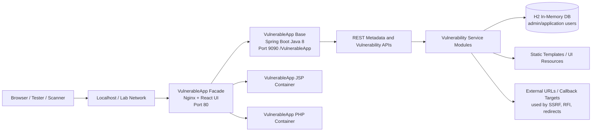

# VulnerableApp Architecture

**Executive summary:** VulnerableApp is a deliberately vulnerable, modular web application used to test vulnerability scanners, security workflows, and threat-modelling logic in a controlled lab environment.

## 1. Purpose and scope

This document describes the architecture of `Security-Phoenix-demo/VulnerableApp` for threat modelling and security testing. The application should be treated as a hostile-by-design lab target, not as a production-ready service.

The scope covers:

- Application purpose and runtime model.
- Main components and trust boundaries.
- Data stores, data flows, and entry points.
- Initial threat-modelling assumptions and starter threats.
- Areas to validate during functional and security testing.

Out of scope:

- Production hardening guidance for deploying this app to the internet.
- Exploit instructions or payload walkthroughs.
- Full code-level review of every vulnerable scenario.

## 2. Application description

VulnerableApp is built to provide reproducible vulnerable web-application scenarios for security engineers, scanner developers, students, and researchers. It exposes intentionally vulnerable features so tools such as DAST scanners, SAST tools, ASPM workflows, and threat-modelling pipelines can be validated against known behaviours.

The application includes:

- A Java 8 / Spring Boot backend.
- A ReactJS / JavaScript / TypeScript user interface layer.
- An embedded H2 in-memory database.
- Docker Compose support for running a facade plus multiple vulnerable application containers.
- REST endpoints that expose vulnerability definitions, scanner metadata, sitemap data, and vulnerability-specific test surfaces.

The repository's README lists these currently handled vulnerability categories:

- JWT weakness scenarios.
- Command injection.
- File upload vulnerability.
- Path traversal.
- SQL injection: error-based, union-based, and blind SQLi.
- XSS: persistent and reflected.
- XXE.
- Open redirect.
- SSRF.

## 3. High-level runtime architecture



## 4. Components

| Component | Technology | Responsibility | Security relevance |
|---|---|---|---|
| Browser / scanner client | Browser, Burp, ZAP, custom scanner | Interacts with UI and test endpoints | Untrusted input source. Generates attack traffic. |
| VulnerableApp facade | Docker container, Nginx/facade UI | Routes traffic to registered vulnerable apps and presents the UI | Main public entry point in Docker deployment. Gateway trust boundary. |
| VulnerableApp base service | Java 8, Spring Boot | Hosts core vulnerable endpoints and metadata APIs | Main attack surface for Java scenarios. |
| Vulnerability modules | Java packages under `org.sasanlabs.service.vulnerability` | Implement scenario-specific vulnerable behaviour | Contains intentionally unsafe logic for SQLi, XSS, SSRF, XXE, command injection, etc. |
| REST metadata controller | Spring MVC controller | Exposes `/allEndPoint`, `/allEndPointJson`, `/VulnerabilityDefinitions`, `/scanner`, `/scanner/metadata`, `/sitemap.xml` | Enables scanners to discover supported test endpoints. |
| H2 database | Embedded in-memory database | Stores seed data for selected vulnerabilities such as SQLi, persistent XSS, and XXE-related examples | Sensitive data and injection target. H2 console is enabled for lab use. |
| Static templates/resources | HTML/CSS/JS/static resources | Renders vulnerability levels and UI templates | Client-side rendering and stored/reflected data flows. |
| Cross-repo vulnerable shared library | Gradle dependency | Optional shared vulnerable library used by the Phoenix demo fork/multirepo variant | Models dependency and supply-chain risk. |

## 5. Deployment views

### 5.1 Docker Compose deployment

The Docker Compose deployment runs a facade on port 80 and routes to multiple vulnerable application containers:

- `VulnerableApp-base`: `sasanlabs/owasp-vulnerableapp:unreleased`
- `VulnerableApp-jsp`: `sasanlabs/owasp-vulnerableapp-jsp:latest`
- `VulnerableApp-php`: `sasanlabs/owasp-vulnerableapp-php:latest`
- `VulnerableApp-facade`: `sasanlabs/owasp-vulnerableapp-facade`, exposed as `80:80`

Primary user URL in Docker mode:

```text
http://localhost
```

### 5.2 Standalone Spring Boot deployment

The standalone deployment runs the Java application directly:

```text
http://localhost:9090/VulnerableApp
```

The embedded H2 console is enabled at:

```text
http://localhost:9090/VulnerableApp/h2
```

Observed lab database configuration:

| Property | Value |
|---|---|
| JDBC URL | `jdbc:h2:mem:testdb` |
| Admin username | `admin` |
| Admin password | `hacker` |
| Application username | `application` |
| Application password | `hacker` |

## 6. Main REST and discovery endpoints

| Endpoint | Purpose | Threat-modelling note |
|---|---|---|
| `/VulnerableApp/allEndPoint` | Returns supported endpoint information as formatted JSON/string output | Useful for scanner discovery; information disclosure is expected in lab context. |
| `/VulnerableApp/allEndPointJson` | Returns supported endpoint information as JSON | Main machine-readable endpoint catalogue. |
| `/VulnerableApp/VulnerabilityDefinitions` | Returns facade-compatible vulnerability definitions | Allows facade and tools to understand available vulnerable surfaces. |
| `/VulnerableApp/scanner` | Returns scanner-oriented endpoint information | Designed for DAST/scanner integration. |
| `/VulnerableApp/scanner/metadata` | Returns vulnerability and parameter-location metadata | Helps normalise scanner output. |
| `/VulnerableApp/sitemap.xml` | Emits a simple sitemap for passive scanners | Expands crawlability and scanner coverage. |
| `/VulnerableApp/h2` | H2 database console | Lab-only admin surface; high-risk if exposed outside localhost/lab network. |

## 7. Trust boundaries

| Boundary | Description | Security question |
|---|---|---|
| Client to facade/base app | Browser/scanner traffic enters the application over HTTP | Is all input treated as attacker-controlled? |
| Facade to application containers | Nginx/facade routes to Java/JSP/PHP containers | Can routing be abused to reach unintended services or paths? |
| Application controller to vulnerability modules | Controllers dispatch requests into intentionally vulnerable handlers | Are vulnerability scenarios isolated from platform/control endpoints? |
| Application to H2 database | Backend executes database queries against in-memory seed data | Which flows use string concatenation, unsafe queries, or exposed credentials? |
| Application to external URLs | SSRF, open redirect, and RFI-style scenarios may interact with external targets | Are outbound calls restricted in the lab environment? |
| Build/dependency boundary | Gradle pulls dependencies and optionally a vulnerable shared library | Are vulnerable/transitive dependencies visible to SCA and ASPM workflows? |
| Threat-modelling artifact boundary | Uploaded architecture/context artifacts are untrusted inputs for the threat-modelling platform | Are architecture files sanitised, reduced, and treated as data only? |

## 8. Data flows

| Flow ID | Source | Destination | Data | Notes |
|---|---|---|---|---|
| DF-01 | Browser/scanner | Facade or Spring Boot app | HTTP requests, query parameters, form fields, files | Primary untrusted input path. |
| DF-02 | Facade | Java/JSP/PHP containers | Routed HTTP requests | Docker-mode routing path. |
| DF-03 | Spring MVC controller | Vulnerability service modules | Normalised request data and route metadata | Dispatch into vulnerable behaviours. |
| DF-04 | Vulnerability modules | H2 database | SQL queries and seed data | SQLi and persistent-data scenarios. |
| DF-05 | Vulnerability modules | Static templates/UI | Rendered HTML/JS/CSS and reflected/stored values | XSS and UI rendering path. |
| DF-06 | Vulnerability modules | Filesystem/container runtime | Uploaded files, path inputs, command strings | File upload, traversal, and command execution scenarios. |
| DF-07 | Vulnerability modules | External URLs/services | URLs, XML references, redirected destinations | SSRF, XXE, open redirect, RFI-style paths. |
| DF-08 | Scanner/discovery tools | Metadata endpoints | Endpoint catalogue, scanner metadata, sitemap | Enables automated testing and threat-model targeting. |

## 9. Assets

| Asset | Why it matters | Sensitivity |
|---|---|---|
| Vulnerability catalogue | Defines supported vulnerable scenarios and levels | Medium - enables discovery by design. |
| Scanner metadata | Maps endpoint behaviour for scanners | Medium - useful for testing and attack planning. |
| H2 seed data | Used by SQLi, XSS, and other scenarios | Medium in lab, high if reused with real data. |
| H2 credentials | Hardcoded lab credentials | High if exposed outside lab. |
| Static templates | Drive UI rendering and attack demonstrations | Medium. |
| Vulnerability modules | Implement unsafe behaviours | High from a testing-control perspective. |
| Docker/container environment | Runtime isolation boundary | High if mounted volumes or host networking are unsafe. |
| Build dependencies | Include intentionally vulnerable dependencies in demo variants | High for supply-chain testing. |

## 10. Threat model starter set

This is a starter set for STRIDE-style threat modelling. It is not a replacement for reviewing each vulnerability level.

| ID | STRIDE | Threat | Attack surface | Impact | Initial control / test question |
|---|---|---|---|---|---|
| TM-01 | Spoofing | Weak or bypassable JWT/authentication scenario | JWT vulnerability module | Unauthorised access in lab scenario | Can scanners detect token manipulation and weak validation patterns? |
| TM-02 | Tampering | SQL injection changes query semantics | SQLi endpoints and H2 database | Data read/write beyond intended path | Are all SQLi variants discoverable: error, union, blind? |
| TM-03 | Repudiation | Lack of reliable audit trail for attack flows | Vulnerability endpoints | Low forensic confidence | Does the app log enough to correlate scanner requests without hiding vulnerable behaviour? |
| TM-04 | Information disclosure | Endpoint catalogue and metadata expose all vulnerable routes | Discovery APIs and sitemap | Easier attack planning | Is this intentional exposure limited to lab deployments? |
| TM-05 | Information disclosure | XXE/SSRF/RFI-style flows retrieve internal or external resources | XML parser, URL handlers, redirect/RFI paths | Data exposure, service probing | Are outbound network paths constrained to a safe lab? |
| TM-06 | Denial of service | Expensive payloads or parser abuse exhaust app resources | XML, file upload, command, regex-like inputs | App/container instability | Are resource limits set on containers? |
| TM-07 | Elevation of privilege | Command injection or unsafe deserialisation executes OS/runtime commands | Command injection, cross-repo demo library | Container compromise | Does container isolation prevent host impact? |
| TM-08 | Tampering | File upload/path traversal writes or reads unintended files | File upload and path traversal modules | File overwrite/read, data leakage | Are uploads isolated to disposable directories? |
| TM-09 | Information disclosure | H2 console and hardcoded credentials are exposed | `/h2`, app properties | Database access | Is H2 reachable only inside local lab scope? |
| TM-10 | Supply chain | Vulnerable/transitive dependencies are inherited by the app | Gradle build and shared library | Known CVEs or reachable vulnerable code | Does SCA map dependencies to runtime and ownership? |

## 11. Threat-modelling assumptions

- The application is intentionally vulnerable and should be run only in a controlled lab environment.
- No production secrets, real customer data, or production network access should be connected to the runtime.
- HTTP is acceptable for local testing; HTTPS and production-grade authentication are outside the lab intent.
- H2 credentials are deliberately weak and should be treated as test data only.
- Scanner-facing discovery endpoints are intentional and should not be interpreted as accidental exposure unless the deployment scope is wrong.
- Architecture/context artifacts used by a threat-modelling platform must be treated as untrusted input and sanitised before prompt or graph processing.

## 12. Test checklist for functionality and threat modelling

### Functional validation

- Start Docker deployment and confirm the facade is reachable on `http://localhost`.
- Start standalone Spring Boot deployment and confirm `http://localhost:9090/VulnerableApp` is reachable.
- Confirm `/allEndPointJson`, `/VulnerabilityDefinitions`, `/scanner`, `/scanner/metadata`, and `/sitemap.xml` return useful discovery data.
- Confirm the H2 console is reachable only in the intended lab deployment.
- Confirm vulnerability levels render in the UI and can be exercised by a scanner.

### Threat-modelling validation

- Build a DFD from the components, boundaries, and data flows above.
- Verify scanner/discovery endpoints become targeting hints.
- Map each vulnerability category to a STRIDE threat and affected asset.
- Validate that file upload, SSRF, XXE, command injection, and open redirect flows are marked as crossing high-risk boundaries.
- Validate that H2 credentials and console exposure are modelled as lab-intentional but high-risk if deployed incorrectly.
- Validate that cross-repo/shared-library dependency paths are visible as supply-chain risks where the multirepo demo variant is used.

## 13. Threat-modelling context integration notes

For a threat-modelling platform that supports architecture artifact intake, use this file as an `ARCHITECTURE_TEXT` or `MARKDOWN` artifact. The most valuable extracted objects are:

- Assets: facade, Spring Boot app, H2 database, vulnerability modules, static templates, scanner metadata, build dependencies.
- Boundaries: client-to-app, facade-to-container, controller-to-module, app-to-H2, app-to-external-network, build/dependency boundary.
- Flows: HTTP request handling, scanner discovery, DB interaction, file upload/path handling, external URL fetch/redirect, static UI rendering.
- Threat seeds: injection, SSRF, XXE, command execution, path traversal, weak JWT, exposed H2 console, vulnerable dependencies.

## 14. Open questions for deeper review

- Which deployment mode is the target for this threat model: Docker facade, standalone Java service, or multirepo dependency demo?
- Are outbound network calls blocked or allowed during testing?
- Are containers running with default Docker privileges, custom networks, or mounted host volumes?
- Is the Phoenix demo fork expected to include the cross-repo `vulnerable-shared-lib` dependency in the tested build?
- Which scanner outputs should be considered authoritative for coverage: DAST crawl, SAST code analysis, SCA dependency scan, or ASPM correlation?

## 15. Recommended next actions

| Owner | Action | Outcome |
|---|---|---|
| AppSec engineer | Import this file into the threat-modelling workflow as architecture context | Baseline DFD and threat seeds. |
| DevSecOps engineer | Run Docker deployment with isolated Docker network and resource limits | Safe, reproducible lab runtime. |
| Security researcher | Exercise discovery endpoints and compare scanner coverage against vulnerability catalogue | Coverage gap report. |
| Platform engineer | Map Gradle dependencies, container images, and runtime endpoints into ASPM | Code-to-runtime traceability. |
| Threat modeller | Convert starter threats into scenarios with assumptions, success criteria, and disproval questions | Actionable threat model. |

## 16. References

- Repository: https://github.com/Security-Phoenix-demo/VulnerableApp
- OWASP VulnerableApp documentation: https://sasanlabs.github.io/VulnerableApp/
- Facade documentation: https://sasanlabs.github.io/VulnerableApp-facade/
- Docker image overview: https://hub.docker.com/r/sasanlabs/owasp-vulnerableapp
- Threat modelling context graph artifact: `threat-modeling-context-graph.md`
