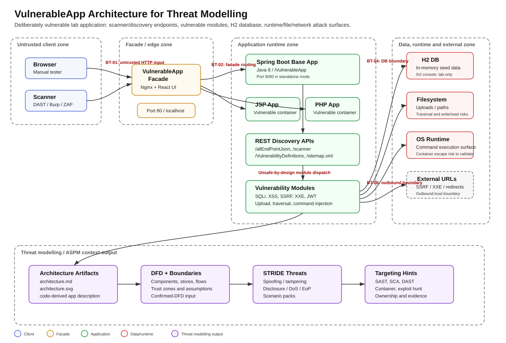

# VulnerableApp Architecture Diagram and Threat-Modelling Prompt

**Executive summary:** This artifact provides a threat-modelling-ready SVG architecture diagram and a reusable prompt for generating architecture descriptions from source code.

## Files

- `vulnerableapp-architecture.svg` — standalone SVG architecture diagram.
- `architecture.md` — existing detailed architecture description.
- `code-to-threat-model-architecture-prompt.md` — reusable prompt for turning application code into threat-modelling architecture context.

## Architecture diagram

## How to use this in threat modelling

1. Upload `architecture.md` as `ARCHITECTURE_TEXT` or `MARKDOWN`.
2. Upload `vulnerableapp-architecture.svg` as `SVG_ARCHITECTURE`.
3. Run `CONFIRMED_DFD` first to create a boundary/flow-driven threat model.
4. Use `VULNERABILITY_DRIVEN` after scanner output or code findings are available.
5. Use the prompt file to regenerate architecture context directly from source code when the application changes.

## Prompt preview

The full prompt is available in `code-to-threat-model-architecture-prompt.md`.

Core instruction:

> Analyse source code, configuration, deployment files, and README material, then produce an architecture description that is purposeful for threat modelling — assets, trust boundaries, data flows, entry points, assumptions, threats, and security test targets.
