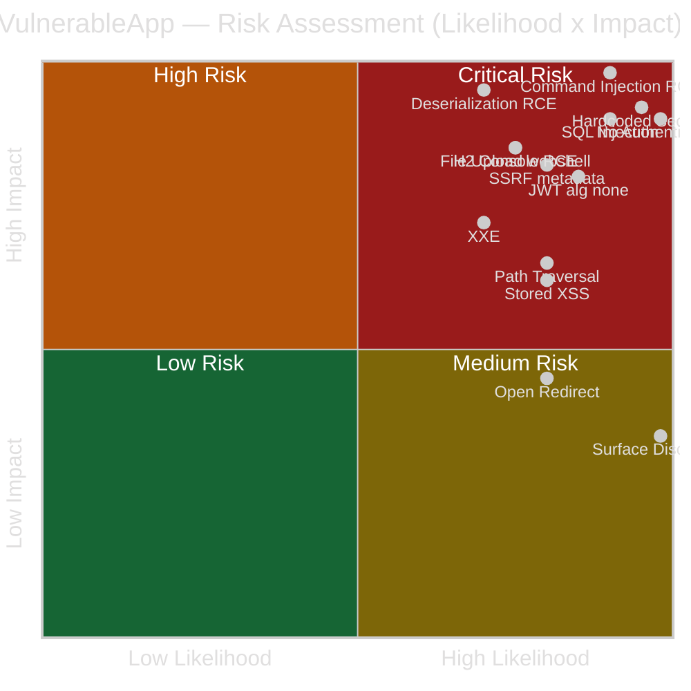

# Threat Model — OWASP VulnerableApp

**Methodology:** STRIDE + DREAD · **Scope:** Full repository (`VulnerableApp` + `VulnerableApp-dependent`)
**Generated:** 2026-07-04 · **Assessment type:** `full_repo` · **Status:** Complete

> ⚠️ **Context:** This is a *deliberately vulnerable* training/scanner-testing application (OWASP VulnerableApp, SasanLabs). Every "threat" below is intentional by design. This model treats it as if it were a real target so the output is useful for (a) validating security scanners against a known ground truth, and (b) demonstrating threat-modeling methodology. **Do not deploy this on any network reachable by untrusted parties.**

---

## 1. Scope & Prerequisites

| Item | Value |
|------|-------|
| Analysis scope | Full repository (2 modules: main app + dependent service/shared-lib) |
| Knowledge graph indexed | N/A (gitnexus backend unavailable — analysis run directly against code) |
| Business context | Security education / scanner ground-truth (OWASP project) |
| Deployment context | Docker Compose, nginx facade (`:80`) → Spring Boot (`:9090`), multi-variant (base/jsp/php) |
| Phoenix CVE enrichment | Manual (backend unavailable) — public CVEs cited where applicable |

---

## 2. Architecture Overview

**Tech stack:** Java · Spring Boot 2.4.5 · Spring Data JPA · H2 (in-memory) · Log4j2 · nimbus-jose-jwt 8.3 · commons-fileupload 1.5 · commons-text 1.8 · org.json 20190722.

**Deployment topology:**
```
Internet ──▶ nginx facade (:80, foobar.com) ──▶ Spring Boot app  /VulnerableApp (:9090)
                                                     │
                          ┌──────────────────────────┼───────────────────────────┐
                          ▼                           ▼                           ▼
                    H2 in-mem DB              External cloud APIs           Local filesystem
                 (admin/hacker,            (AWS/GCP/Stripe/Jira +          (path traversal,
                  application/hacker)        arbitrary URLs via SSRF)        file upload)
                          │
                          ▼
              VulnerableApp-dependent (cross-repo service + shared-lib w/ fake sanitizers)
```

**Trust boundaries (TB):**
- **TB1** Internet → nginx → Spring app *(no authentication anywhere)*
- **TB2** App → H2 database (H2 web console **exposed** at `/VulnerableApp/h2`)
- **TB3** App → external internet (outbound HTTP with embedded secrets; SSRF to arbitrary hosts incl. cloud metadata `169.254.169.254`)
- **TB4** App ↔ `VulnerableApp-dependent` (cross-module taint through *ineffective* shared-lib sanitizers)
- **TB5** App → local filesystem

**Entry points (attack surface):**

| Endpoint | Auth | Notes |
|----------|------|-------|
| `/VulnerableApp/{Vuln}/{LEVEL}?param=…` | None | Core vulnerability endpoints (13 categories, multi-level) |
| `/VulnerableApp/allEndPoint`, `/allEndPointJson`, `/VulnerabilityDefinitions` | None | Full self-describing attack-surface enumeration |
| `/VulnerableApp/scanner`, `/scanner/metadata`, `/sitemap.xml` | None | Machine-readable map of every vuln endpoint |
| `/VulnerableApp/h2` | DB creds (weak) | H2 web console enabled |
| `/api/secrets/{aws/identity, jira/issue, gcp/buckets, aws/s3/list}` | None | Hardcoded cloud creds invoked in outbound HTTP + logged |
| `/api/payment/{balance,…}` | None | Hardcoded Stripe **live-format** key invoked in outbound HTTP |

**Key architectural weaknesses (systemic):**
1. **No authentication / authorization** — no Spring Security on the classpath; every endpoint is anonymous.
2. **Self-documenting attack surface** — `/allEndPointJson` + `/sitemap.xml` hand an attacker the complete endpoint inventory.
3. **Hardcoded secrets in source** — AWS/GCP/Stripe/Jira credentials embedded, *invoked* over the network and *logged*.
4. **Ineffective shared sanitizers** — `CommandSanitizer`, `SQLParameterizer`, `URLValidator`, `HTMLSanitizer` in the shared lib give a false sense of protection while taint reaches sinks.
5. **Verbose debug logging** — `logging.level.org.springframework.web=DEBUG`, `org.hibernate=DEBUG`.

---

## 3. STRIDE Threat Model

24 threats across all six categories. IDs map to DREAD scores in §4.

### Spoofing
| ID | Threat | Component / Sink | TB |
|----|--------|------------------|----|
| S-1 | **No authentication** — any client acts as any user; no identity established | Whole app (no Spring Security) | TB1 |
| S-2 | **JWT `alg:none` accepted** — forged unsigned tokens pass validation | `JWTValidator.customHMACNoneAlgorithmVulnerableValidator` | TB1 |
| S-3 | **JWT null-byte / weak-key HMAC bypass** — signature check circumvented | `JWTValidator.customHMACNullByteVulnerableValidator` | TB1 |

### Tampering
| ID | Threat | Component / Sink | TB |
|----|--------|------------------|----|
| T-1 | **SQL Injection** — string-concatenated queries (`"select * from cars where id=" + id`) | `UnionBased`/`BlindSQLInjectionVulnerability`, `CrossRepoSQLInjection` | TB2 |
| T-2 | **OS Command Injection** — `ProcessBuilder("sh","-c","ping … "+ip)` | `CommandInjection`, `CrossRepoCommandInjection` | TB5 |
| T-3 | **Unsafe deserialization** — untrusted object stream deserialized | `CrossRepoDeserialization` | TB4 |
| T-4 | **Unrestricted file upload** — attacker writes arbitrary files | `fileupload/*`, `PreflightController` (`FileInputStream`) | TB5 |
| T-5 | **XXE** (on vulnerable levels) — external entities processed | `XXEVulnerability` (levels w/o `disallow-doctype-decl`) | TB1/TB3 |
| T-6 | **Stored/Persistent XSS** — attacker script persisted, served to others | `xss/*` (PersistentXSS) | TB1 |

### Repudiation
| ID | Threat | Component / Sink | TB |
|----|--------|------------------|----|
| R-1 | **No audit logging of security events** — no auth = no attributable actor | Whole app | TB1 |
| R-2 | **Secrets & requests in DEBUG logs** — logs are tamperable / unattributable and leak data | `application.properties`, `CloudCredentialService.log.info(...AWS key...)` | TB2 |

### Information Disclosure
| ID | Threat | Component / Sink | TB |
|----|--------|------------------|----|
| I-1 | **Hardcoded cloud credentials leaked** (AWS, GCP SA key, Stripe live-format, Jira) — exposed in source, invoked over HTTP, logged | `secretleak/CloudCredentialService`, `secretleak/PaymentService` | TB3 |
| I-2 | **SSRF → cloud metadata** — fetch `http://169.254.169.254/…` to steal instance creds | `SSRFVulnerability` (levels w/o allow-listing) | TB3 |
| I-3 | **Path Traversal** — `getResourceAsStream("/scripts/PathTraversal/" + fileName)` reads arbitrary bundled files | `PathTraversalVulnerability` | TB5 |
| I-4 | **Reflected XSS** — attacker steals session/DOM data via injected script | `xss/*` (reflected levels) | TB1 |
| I-5 | **Attack-surface disclosure** — `/allEndPointJson`, `/sitemap.xml` enumerate every endpoint & parameter | `VulnerableAppRestController` | TB1 |
| I-6 | **H2 console exposed** — DB browsing / potential RCE via JDBC URL abuse | `/VulnerableApp/h2` (console enabled) | TB2 |
| I-7 | **Verbose error / stack traces** — framework debug output aids recon | `ControllerExceptionHandler`, DEBUG logging | TB1 |
| I-8 | **Local/Remote File Inclusion** — include attacker-controlled content | `rfi/*` | TB3/TB5 |

### Denial of Service
| ID | Threat | Component / Sink | TB |
|----|--------|------------------|----|
| D-1 | **XXE billion-laughs / entity expansion** — memory/CPU exhaustion | `XXEVulnerability` | TB1 |
| D-2 | **Unbounded file upload** — disk / memory exhaustion | `fileupload/*` (commons-fileupload 1.5) | TB5 |
| D-3 | **SSRF-driven internal port scanning / amplification** | `SSRFVulnerability` | TB3 |
| D-4 | **No rate limiting** — brute force / resource exhaustion on any endpoint | Whole app | TB1 |

### Elevation of Privilege
| ID | Threat | Component / Sink | TB |
|----|--------|------------------|----|
| E-1 | **Command Injection → RCE → host takeover** | `CommandInjection` (`sh -c`) | TB5 |
| E-2 | **Deserialization → RCE** (gadget chain via commons-* / org.json on classpath) | `CrossRepoDeserialization` | TB4 |
| E-3 | **H2 console JDBC abuse → RCE** (CVE-2021-42392 / CVE-2022-23221 class) | `/h2` console | TB2 |
| E-4 | **Open Redirect → phishing / OAuth token theft** | `openRedirect/Http3xxStatusCodeBasedInjection` | TB1 |

---

## 4. DREAD Risk Assessment

Scores 1–10 per dimension; **Risk = mean(D,R,E,A,Di)**. Level: ≥8 Critical · 6–7.9 High · 4–5.9 Medium · <4 Low.

| ID | Threat | D | R | E | A | Di | **Risk** | Level |
|----|--------|---|---|---|---|----|----------|-------|
| E-1 | Command Injection → RCE | 10 | 9 | 9 | 8 | 9 | **9.0** | 🔴 Critical |
| E-2 | Deserialization → RCE | 10 | 8 | 8 | 8 | 7 | **8.2** | 🔴 Critical |
| I-1 | Hardcoded cloud credentials leaked | 9 | 10 | 9 | 7 | 9 | **8.8** | 🔴 Critical |
| T-1 | SQL Injection | 9 | 9 | 9 | 8 | 9 | **8.8** | 🔴 Critical |
| E-3 | H2 console → RCE | 9 | 8 | 7 | 7 | 8 | **7.8** | 🟠 High |
| I-2 | SSRF → cloud metadata creds | 9 | 8 | 8 | 7 | 7 | **7.8** | 🟠 High |
| S-2 | JWT `alg:none` auth bypass | 8 | 9 | 8 | 8 | 6 | **7.8** | 🟠 High |
| S-1 | No authentication | 8 | 10 | 10 | 9 | 8 | **9.0** | 🔴 Critical |
| T-4 | Unrestricted file upload → webshell | 9 | 8 | 7 | 7 | 7 | **7.6** | 🟠 High |
| T-5 | XXE (file read / SSRF) | 8 | 8 | 7 | 6 | 7 | **7.2** | 🟠 High |
| T-3 | Unsafe deserialization (data tamper) | 8 | 7 | 7 | 7 | 6 | **7.0** | 🟠 High |
| S-3 | JWT null-byte/weak-key bypass | 7 | 8 | 7 | 7 | 6 | **7.0** | 🟠 High |
| T-6 | Stored XSS | 7 | 8 | 8 | 7 | 7 | **7.4** | 🟠 High |
| I-3 | Path Traversal | 7 | 8 | 8 | 6 | 8 | **7.4** | 🟠 High |
| I-6 | H2 console exposed (browse) | 7 | 9 | 8 | 6 | 8 | **7.6** | 🟠 High |
| I-4 | Reflected XSS | 6 | 8 | 8 | 6 | 7 | **7.0** | 🟠 High |
| I-8 | RFI/LFI | 7 | 6 | 6 | 6 | 6 | **6.2** | 🟠 High |
| E-4 | Open Redirect | 5 | 8 | 8 | 6 | 7 | **6.8** | 🟠 High |
| I-5 | Attack-surface disclosure | 4 | 10 | 10 | 6 | 10 | **8.0** | 🔴 Critical* |
| R-2 | Secrets/requests in DEBUG logs | 7 | 8 | 6 | 5 | 6 | **6.4** | 🟠 High |
| D-1 | XXE entity expansion DoS | 6 | 8 | 7 | 6 | 6 | **6.6** | 🟠 High |
| D-2 | Unbounded upload DoS | 5 | 8 | 7 | 6 | 6 | **6.4** | 🟠 High |
| D-4 | No rate limiting | 5 | 9 | 9 | 6 | 7 | **7.2** | 🟠 High |
| R-1 | No audit logging | 5 | 9 | 8 | 5 | 6 | **6.6** | 🟠 High |
| D-3 | SSRF port scan / amplification | 5 | 7 | 7 | 5 | 6 | **6.0** | 🟠 High |
| I-7 | Verbose errors / recon | 3 | 9 | 9 | 4 | 8 | **6.6** | 🟠 High |

\* I-5 scores "Critical" on ease/discoverability but its *damage* is low — it's an enabler, not a direct impact.

**Summary:** 6 Critical · 20 High · 0 Medium/Low. Overall posture: **CRITICAL** (by design).

---

## 5. Risk Matrix

| Impact ↓ / Likelihood → | 🟢 Low | 🟡 Medium | 🟠 High | 🔴 Very High |
|-------------------------|--------|-----------|---------|--------------|
| 🔴 **Critical** | — | E-2 (Deser RCE) | E-1 (Cmd Inj), T-1 (SQLi) | S-1 (No auth), I-1 (Secrets) |
| 🟠 **High** | I-8 (RFI) | T-3, D-3 | E-3, I-2 (SSRF), T-4, T-5, S-3 | S-2 (JWT none), I-6 (H2) |
| 🟡 **Medium** | — | R-1, D-2, R-2 | I-3, I-4, T-6, E-4, D-1, D-4 | I-5 (surface disclosure) |
| 🟢 **Low** | — | — | I-7 (verbose errors) | — |



---

## 6. Attack Scenarios

### SCENARIO_001 — Reconnaissance → SQLi → Data Exfiltration
**Threats:** I-5 → T-1 · **Risk:** 8.8 · **CVE class:** CWE-89
1. **Recon (T1595):** GET `/VulnerableApp/allEndPointJson` + `/sitemap.xml` → full endpoint & parameter inventory. *Indicator: bulk hits on enumeration endpoints.*
2. **Initial Access (T1190):** Inject `id=1 UNION SELECT …` into `UnionBasedSQLInjectionVulnerability` (`select * from cars where id='<id>'`). *Indicator: SQL syntax in params, H2 errors.*
3. **Collection (T1213):** Enumerate schema, pivot to `INFORMATION_SCHEMA`. *Indicator: metadata queries.*
4. **Exfiltration (T1041):** Return rows in HTTP response.
**Detection:** WAF SQLi signatures · Hibernate query anomaly detection · alert on enumeration endpoints.
**Mitigation:** Parameterized queries (`PreparedStatement`/JPA bind params — a safe variant already exists in the same class, line ~110), remove self-describing endpoints in prod.

### SCENARIO_002 — Command Injection → RCE → Host Takeover
**Threats:** E-1 · **Risk:** 9.0 · **CVE class:** CWE-78
1. **Initial Access (T1190):** `ipAddress = "127.0.0.1; id; cat /etc/passwd"` into `CommandInjection` → `ProcessBuilder("sh","-c","ping -c 2 "+ip)`.
2. **Execution (T1059):** Arbitrary shell; chain reverse shell.
3. **Cross-repo variant:** `CrossRepoCommandInjection` routes input through `CommandSanitizer.sanitize()` (ineffective) → same sink.
**Detection:** egress monitoring, unexpected child processes of the JVM, shell metachars in params.
**Mitigation:** avoid shell; use argument arrays without `sh -c`; strict allow-list validation (real, not the shared-lib stub).

### SCENARIO_003 — Secret Harvest → Cloud Pivot
**Threats:** I-1 (+ I-2 alternative) · **Risk:** 8.8 · **CVE class:** CWE-798 / CWE-312
1. **Credential Access (T1552.001):** Read hardcoded AWS/GCP/Stripe/Jira keys from source *or* trigger `/api/secrets/aws/identity` — key is logged (`log.info("...key {}...", AWS_ACCESS_KEY_ID)`) and sent outbound.
2. **Alternative (T1552.005):** SSRF `url=http://169.254.169.254/latest/meta-data/iam/security-credentials/` via `SSRFVulnerability` → steal instance role creds.
3. **Lateral Movement / Impact (T1078.004):** Use creds against AWS STS / GCP Storage / Stripe API.
**Detection:** secret scanning (ground truth: 4 scenarios in `secretleak/`), egress to cloud APIs, metadata-IP access from app.
**Mitigation:** externalize secrets (vault/env), never log credentials, SSRF allow-list + block link-local `169.254.0.0/16`.

### SCENARIO_004 — JWT Forgery → Auth Bypass
**Threats:** S-2/S-3 · **Risk:** 7.8 · **CVE class:** CWE-347
1. Craft JWT with `{"alg":"none"}` and forged claims.
2. `customHMACNoneAlgorithmVulnerableValidator` accepts it (checks `alg==none` then skips signature). Null-byte variant similarly bypasses HMAC.
**Detection:** reject `none`; monitor tokens with empty signatures.
**Mitigation:** enforce server-side allow-list of algorithms; use vetted library verification only.

### SCENARIO_005 — File Upload → Webshell → RCE
**Threats:** T-4 → E-1 · **Risk:** 7.6 · **CVE class:** CWE-434
1. Upload executable/script via `fileupload/*` (no type/size restriction, commons-fileupload 1.5).
2. Access uploaded file → code execution / traversal via `PreflightController` `FileInputStream`.
**Mitigation:** validate content-type & magic bytes, randomize names, store outside web root, cap size.

---

## 7. Attack Tree

```mermaid
graph TD
    ROOT["🎯 Compromise VulnerableApp"]

    ROOT --> A1["Achieve RCE"]
    ROOT --> A2["Exfiltrate Data"]
    ROOT --> A3["Bypass Authentication"]
    ROOT --> A4["Pivot to Cloud"]

    A1 --> A1a["Command Injection<br/>(sh -c + ping) · L:0.9"]
    A1 --> A1b["Deserialization gadget<br/>· L:0.7"]
    A1 --> A1c["H2 console JDBC abuse<br/>· L:0.75"]
    A1 --> A1d["File upload webshell<br/>· L:0.75"]

    A2 --> A2a["SQL Injection<br/>(string concat) · L:0.9"]
    A2 --> A2b["Path Traversal<br/>· L:0.8"]
    A2 --> A2c["XXE file read<br/>· L:0.7"]
    A2 --> A2d["Stored/Reflected XSS<br/>· L:0.8"]

    A3 --> A3a["No auth at all<br/>· L:0.98"]
    A3 --> A3b["JWT alg:none<br/>· L:0.85"]
    A3 --> A3c["JWT null-byte HMAC<br/>· L:0.7"]

    A4 --> A4a["Harvest hardcoded keys<br/>(AWS/GCP/Stripe/Jira) · L:0.95"]
    A4 --> A4b["SSRF to 169.254.169.254<br/>· L:0.8"]
    A4 --> A4c["Keys leaked to logs<br/>· L:0.9"]

    classDef crit fill:#991b1b,stroke:#fff,color:#fff;
    classDef high fill:#b45309,stroke:#fff,color:#fff;
    class A1a,A2a,A3a,A4a crit;
    class A1b,A1c,A1d,A2b,A2c,A2d,A3b,A3c,A4b,A4c high;
```



---

## 8. Mitigation Roadmap

### Immediate (0–30 days) — Critical
- **Never deploy on an untrusted network** (isolate to localhost/lab).
- Remove hardcoded credentials from `secretleak/*`; rotate anything real; stop logging secrets (R-2/I-1).
- Parameterize all SQL (T-1) — safe variants already exist in-tree; make them the only path.
- Eliminate `sh -c` command construction (E-1); reject shell metacharacters.
- Disable H2 console (`spring.h2.console.enabled=false`) and bind DB to localhost (I-6/E-3).

### Short-term (1–6 months) — High
- Add Spring Security: authentication + RBAC on all endpoints (S-1); remove `/allEndPointJson`,`/sitemap.xml`,`/scanner*` from prod (I-5).
- Enforce JWT algorithm allow-list; drop `none` and custom validators (S-2/S-3).
- Harden XML parsers everywhere: `disallow-doctype-decl=true` (T-5/D-1) — pattern already present on some levels.
- SSRF allow-list + block link-local/private ranges incl. `169.254.169.254` (I-2/D-3).
- File-upload: type/size/magic-byte validation, store outside web root (T-4/D-2).
- Output-encode all reflected/stored data (T-6/I-4); output-redirect allow-list (E-4).
- Set logging to INFO; add security audit trail (R-1/R-2/I-7).
- Replace the shared-lib **stub sanitizers** with real, tested implementations, or delete them (they create false assurance across TB4).

### Preventive / Detective / Corrective controls
| Type | Control |
|------|---------|
| Preventive | Input validation at boundaries, parameterized queries, secrets vault, SSRF allow-list, authN/authZ, algorithm allow-list |
| Detective | WAF, egress monitoring, secret scanning (Phoenix), query/anomaly detection, metadata-IP alerts |
| Corrective | Credential rotation, incident runbook, auto-block on WAF hits, dependency patching |

---

## 9. Dependency / CVE Notes (public, manual)

| Component | Version | Concern |
|-----------|---------|---------|
| Log4j2 (spring-boot-starter-log4j2) | 2.4.5 mgmt | Verify effective log4j-core ≥ 2.17.1 (CVE-2021-44228 Log4Shell family) |
| H2 database | 1.3.176 | Old; H2 console RCE class (CVE-2021-42392 / CVE-2022-23221) — console is **enabled** |
| commons-fileupload | 1.5 | DoS history; ensure size limits (CVE-2023-24998 patched in 1.5, but config-dependent) |
| org.json | 20190722 | Older; parsing DoS advisories in later CVEs |
| nimbus-jose-jwt | 8.3 | Keep current; JWT handling is custom-vulnerable regardless |
| commons-text | 1.8 | ⚠️ CVE-2022-42889 "Text4Shell" affects 1.5–1.9 — **1.8 is in range**; verify interpolation usage |

> `CrossRepoXSS` comment references `${script:javascript:…exec('cmd')}` — a commons-text `StringSubstitutor` interpolation vector (Text4Shell, CVE-2022-42889). Flag as a **real dependency-driven RCE path**, not just XSS.

---

## 10. Compliance Mapping (illustrative)

| Framework | Failing controls (examples) |
|-----------|------------------------------|
| OWASP Top 10 2021 | A01 (S-1, E-4), A02 (I-1, R-2), A03 (T-1,T-2,T-5,T-6,I-4), A05 (I-6,I-7), A06 (§9), A07 (S-2,S-3), A08 (T-3), A10 (I-2) |
| OWASP ASVS | V2 (auth), V5 (validation/encoding), V6 (crypto/secrets), V12 (files), V14 (config) |
| PCI-DSS (if payment path real) | 6.2.4, 6.5.1, 6.5.8, 8.x (Stripe key handling in `PaymentService`) |
| CWE Top 25 | 79, 78, 89, 22, 434, 502, 798, 611, 918 all present |

---
*STRIDE/DREAD threat model generated by the `threat-modeling` skill. gitnexus/Phoenix backends were unavailable; analysis was performed directly against source. Re-run with the graph backend for symbol-level blast-radius and live CVE enrichment.*
